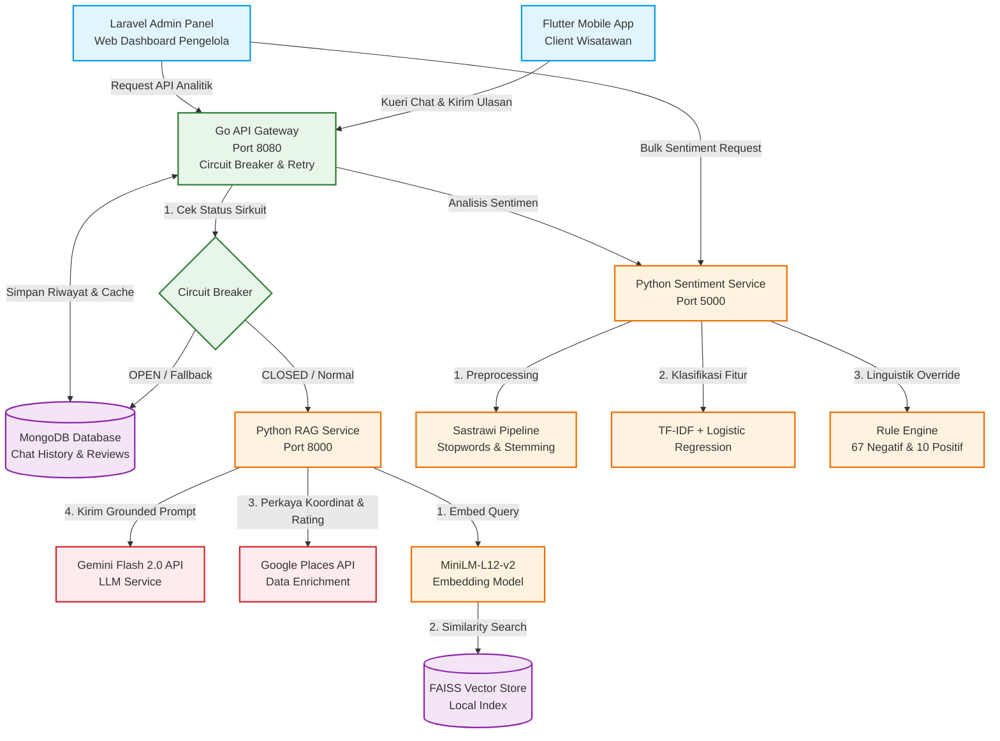

# DOKUMEN TAMBAHAN LAPORAN MACHINE LEARNING
## SISTEM SMART TOURISM DANAU TOBA BERBASIS CHATBOT DAN ANALISIS SENTIMEN HIBRIDA

Dokumen ini berisi materi lengkap hasil perbaikan dan penambahan untuk Laporan Machine Learning sesuai rekomendasi evaluasi. Bagian-bagian di bawah ini dirancang dengan standar penulisan akademis dan dapat langsung disisipkan ke berkas laporan utama.

---

### BAB 3.2: ARSITEKTUR SISTEM TERDISTRIBUSI

Sistem *Smart Tourism* Danau Toba dirancang menggunakan arsitektur *microservices* terdistribusi yang terdiri atas lima komponen utama yang saling berinteraksi melalui protokol RESTful API. Desain arsitektur ini memisahkan tanggung jawab komputasi berat pemrosesan bahasa alami (NLP & LLM) dari pengelolaan antarmuka pengguna (*client panel*). 

Gerbang masuk utama ke seluruh layanan backend dikelola oleh **Go Backend** yang bertindak sebagai *API Gateway*. Untuk menjamin ketahanan sistem (*fault tolerance*) terhadap kegagalan parsial pada layanan AI, Go Backend mengimplementasikan pola **Circuit Breaker** (dengan batasan kegagalan berturut-turut/`failureLimit` sebanyak 3 kali, dan waktu pemutusan/`openTimeout` selama 30 detik) serta mekanisme **Exponential Backoff Retry** (2 kali percobaan ulang dengan jeda terkalibrasi). Jika layanan RAG mengalami gangguan total, sirkuit akan terbuka (*open status*), dan Go Backend akan mengalihkan request secara otomatis (*fallback*) ke data *cache session* statis pada database **MongoDB**.

Layanan analitik data dikelola oleh dasbor **Laravel Admin Panel** yang secara langsung berinteraksi dengan **Python Sentiment Service** untuk kebutuhan analisis sentimen ulasan secara massal (*bulk prediction*), visualisasi statistik kepuasan pengunjung, serta pemantauan aspek keluhan secara *real-time*.

Berikut adalah diagram alur data dan arsitektur sistem terintegrasi:



---

### BAB 4: TAMBAHAN SUBBAB IMPLEMENTASI RAG DAN SMART TRIP PLANNER

#### 4.3 Implementasi Retrieval-Augmented Generation (RAG) pada Chatbot Pariwisata
Modul asisten virtual (chatbot) pariwisata mengintegrasikan metode *Retrieval-Augmented Generation* (RAG) untuk mengatasi keterbatasan LLM dalam menyajikan data lokal Kabupaten Toba yang dinamis dan faktual. Proses RAG terdiri atas tiga fase terintegrasi: *embedding*, *indexing*, dan *retrieval*.

##### 4.3.1 Representasi Vektor dan Proses Embedding
Pertanyaan pengguna (*user query*) yang berupa teks tidak terstruktur harus dikonversi menjadi representasi numerik (vektor densitas) sebelum dilakukan pencarian semantik. Sistem menggunakan model pre-trained **`paraphrase-multilingual-MiniLM-L12-v2`** yang dikembangkan oleh Sentence-Transformers. Pilihan model ini didasarkan pada ukuran berkas yang sangat ringkas ($\sim 120$ MB) sehingga efisien dijalankan di lingkungan CPU server tanpa latensi tinggi, namun memiliki dukungan performa multibahasa (termasuk Bahasa Indonesia informal) yang solid.

Proses embedding secara matematis dapat dituliskan sebagai fungsi pemetaan teks ke ruang vektor berdimensi $d = 384$:
$$\mathbf{u} = f_{\text{MiniLM}}(q) \in \mathbb{R}^{384}$$

Untuk memastikan pencarian kemiripan yang konsisten, setiap vektor yang dihasilkan didekatkan ke norma unit L2 melalui proses normalisasi:
$$\hat{\mathbf{u}} = \frac{\mathbf{u}}{\|\mathbf{u}\|_2} = \frac{\mathbf{u}}{\sqrt{\sum_{i=1}^{d} u_i^2}}$$

##### 4.3.2 Proses Pengindeksan (Indexing)
Basis pengetahuan (*knowledge base*) chatbot bersumber dari dokumen deskriptif terstruktur mengenai destinasi wisata, agenda budaya, fasilitas sanitasi, serta kuliner khas Danau Toba di Kabupaten Toba. Dokumen tersebut dipecah menggunakan strategi *character-based chunking* dengan parameter ukuran potongan (*chunk size*) $N = 500$ karakter dan tumpang tindih (*overlap*) $O = 100$ karakter. Tumpang tindih ini bertujuan untuk mempertahankan kontinuitas makna kata yang berada di batas pemotongan dokumen.

Setiap potongan dokumen ($c_j$) dikonversi menjadi vektor embedding $\hat{\mathbf{v}}_j$ menggunakan model MiniLM yang sama dan disimpan ke dalam database vektor lokal menggunakan **FAISS (Facebook AI Similarity Search)**. Sistem menginisialisasi struktur indeks **`IndexFlatIP`** (Inner Product). Indeks ini sangat optimal karena ketika semua vektor pencarian dan penyimpanan telah dinormalisasi L2, operasi *Inner Product* (dot product) secara matematis bernilai sama dengan *Cosine Similarity*:
$$\text{Similarity}(\hat{\mathbf{u}}, \hat{\mathbf{v}}_j) = \hat{\mathbf{u}} \cdot \hat{\mathbf{v}}_j = \sum_{i=1}^{d} \hat{u}_i \hat{v}_{j,i}$$

ID unik dari setiap vektor yang tersimpan dalam FAISS dihubungkan secara relasional dengan koleksi data MongoDB yang memuat metadata lengkap destinasi wisata (seperti ulasan riil, jam buka, dan titik koordinat GPS).

##### 4.3.3 Fase Pencarian dan Penarikan Data (Retrieval)
Saat kueri pengguna masuk, sistem melakukan tahapan penarikan dokumen sebagai berikut:
1. Kueri pengguna $q$ dikonversi menjadi vektor kueri $\hat{\mathbf{u}}$.
2. FAISS melakukan pencarian tetangga terdekat dengan komputasi paralel untuk menyeleksi sejumlah $k$ ($k = 5$) dokumen dengan nilai kemiripan tertinggi.
3. Penerapan parameter ambang batas (*similarity threshold*): Hanya potongan dokumen dengan nilai $\text{Similarity}(\hat{\mathbf{u}}, \hat{\mathbf{v}}_j) \ge 0.68$ yang akan ditarik. Dokumen di bawah nilai tersebut dieliminasi untuk menghindari masuknya informasi tidak relevan (*noise*).
4. Penggabungan konteks (*Context Assembly*): Potongan dokumen yang lolos filtrasi digabungkan menjadi satu string konteks utuh $\mathcal{C}$ untuk disisipkan ke dalam prompt instruksi model generatif.

---

#### 4.4 Alur Prompt Engineering pada Modul Smart Trip Planner
Modul *Smart Trip Planner* menghasilkan rencana perjalanan harian (*itinerary*) yang disesuaikan dengan preferensi spesifik wisatawan. Keberhasilan proses pemodelan ini sangat bergantung pada kualitas instruksi yang dikirimkan ke LLM Gemini Flash 2.0 melalui perancangan prompt terstruktur (*Prompt Engineering*).

Proses rekayasa prompt mengadopsi teknik **Grounded Prompting** dan **Structured Few-Shot Prompting**. Prompt dirancang untuk membatasi ruang kognitif LLM agar hanya menyusun rencana perjalanan berdasarkan destinasi wisata riil yang disuplai oleh database vektor (grounded data) serta diperkaya datanya menggunakan Google Places API.

Berikut adalah cetak biru instruksi prompt (*system instruction* dan *grounded template*) yang digunakan pada backend:

```text
================================================================================
SYSTEM INSTRUCTIONS (Instruksi Peran & Batasan Ketat)
================================================================================
Anda adalah asisten perencana perjalanan (Trip Planner) ahli khusus untuk wilayah Kabupaten Toba, Danau Toba. Tugas Anda adalah membuat rencana perjalanan (itinerary) harian yang logis, santai, dan efisien secara rute berdasarkan data destinasi wisata riil yang disediakan dalam konteks.

Patuhi batasan ketat berikut:
1. HANYA gunakan destinasi wisata yang secara eksplisit tertulis di dalam daftar "Grounded Context Destinasi" di bawah. Dilarang keras merekomendasikan tempat fiktif atau di luar daftar tersebut.
2. Estimasi waktu tempuh antar destinasi ('travel_time_minutes') harus logis berdasarkan jarak geografis dan moda transportasi yang dipilih pengguna.
3. Format keluaran wajib berupa JSON valid tunggal tanpa penjelasan markdown di luar blok JSON. Skema JSON harus mengikuti struktur yang didefinisikan di bawah.

================================================================================
GROUNDED TEMPLATE (Template Penggabungan Masukan & Konteks)
================================================================================
Grounded Context Destinasi:
{grounded_retrieved_context}

Preferensi Wisatawan:
- Durasi Perjalanan: {user_total_days} Hari
- Kategori Minat: {user_categories} (contoh: wisata alam, budaya, kuliner)
- Rombongan Perjalanan: {user_group_type} (contoh: keluarga dengan anak, solo, pasangan)
- Moda Transportasi: {user_transport} (contoh: Kendaraan Pribadi, Sewa Sepeda Motor)
- Titik Keberangkatan Awal: {user_start_location}

Contoh Luaran JSON (Few-Shot Example):
{{
  "success": true,
  "summary": {{
    "title": "Eksplorasi Sejarah Batak dan Alam Balige",
    "total_destinations": 3,
    "total_days": 1,
    "start_location": "Balige",
    "transport": "Kendaraan Pribadi"
  }},
  "days": [
    {{
      "day_number": 1,
      "date_label": "Hari 1",
      "start_from": "Hotel Balige",
      "total_destinations": 2,
      "activities": [
        {{
          "time": "08:00 - 10:00",
          "category": "nature",
          "name": "Pantai Bulbul",
          "description": "Pantai berpasir putih di tepian Danau Toba, Balige. Sangat ramah anak.",
          "duration_hours": 2.0,
          "travel_time_minutes": 15,
          "travel_mode": "Berkendara",
          "tips": "Datang pagi hari untuk menikmati udara segar dan menghindari terik matahari."
        }}
      ],
      "smart_tip": "Gunakan pakaian kasual yang nyaman dan bawa sunblock untuk aktivitas pantai."
    }}
  ]
}}

Hasilkan rencana perjalanan dalam format JSON valid berdasarkan preferensi wisatawan di atas:
JSON:
================================================================================
```

Prosedur validasi di Go Backend secara otomatis akan memverifikasi integritas struktur JSON yang dikembalikan oleh Gemini Flash. Jika struktur JSON rusak atau tidak sesuai skema (misalnya akibat pembatasan token di tengah jalan), backend Go akan melakukan deteksi dini, menangkap error parsing, dan menjalankan kueri ulang secara otomatis (*auto-retry*) sebanyak 1 kali sebelum mengirimkan respons ke *client mobile*.

---

### BAB 5: ANALISIS KINERJA RAG MENDALAM

Untuk mengukur dampak nyata dari implementasi *Retrieval-Augmented Generation* (RAG) pada modul asisten virtual, tim pengembang melakukan analisis performa komprehensif yang berfokus pada dua aspek: efisiensi waktu respons (analisis latensi) dan kualitas konten informasi (metrik semantik).

#### 5.2 Analisis Kinerja dan Latensi Chatbot RAG

##### 5.2.1 Analisis Detail Komponen Latensi
Berdasarkan pengujian internal terhadap 50 skenario kueri uji, rata-rata waktu respons chatbot dengan RAG adalah **1,8 detik** (naik dari 0,9 detik pada model dasar tanpa RAG). Waktu respons ini dievaluasi masih berada dalam batas kenyamanan interaksi pengguna aplikasi mobile ($< 2,0$ detik). 

Pencatatan metrik *profiling* pada server menunjukkan kontribusi waktu (latensi) dari masing-masing sub-proses pemrosesan data sebagai berikut:

1. **Pembuatan Embedding Kueri (Query Embedding Generation)**: $\sim 420$ ms. Proses pemanggilan model `MiniLM-L12-v2` secara lokal menggunakan CPU untuk merubah kueri pengguna menjadi vektor berdimensi 384. Latensi ini dipengaruhi oleh kapasitas pengolahan *multithreading* pada inti prosesor server.
2. **Pencarian Kesamaan FAISS (Vector Search)**: $\sim 30$ ms. Fase pencarian indeks tetangga terdekat pada koleksi dokumen. FAISS membuktikan efisiensinya dengan menyelesaikan pencarian semantik sub-milidetik per kueri berkat optimasi komputasi matriks di memori.
3. **Pengayaan Data Eksternal (Google Places API Enrichment)**: $\sim 350$ ms. Panggilan HTTP eksternal ke server Google untuk menarik data *real-time* seperti titik koordinat GPS ter-update, penilaian rating bintang, serta jam operasional terkini destinasi wisata yang terpilih.
4. **Generasi Respons Generatif (Gemini Flash 2.0 API Inference)**: $\sim 1000$ ms. Pengiriman *grounded prompt* terenkapsulasi ke API Google Gemini. Proses ini mencakup transfer data jaringan (network round-trip) dan waktu inferensi model LLM untuk merangkai teks jawaban akhir.

##### 5.2.2 Evaluasi Kualitas Konten Informasi (Metrik Evaluasi RAG)
Untuk menilai keandalan informasi yang dihasilkan oleh chatbot RAG, pengujian dilakukan dengan mengadopsi tiga metrik utama yang menyimulasikan kerangka kerja evaluasi RAGAS (Retrieval-Augmented Generation Assessment). Hasil pengukuran kualitatif dari 50 skenario uji dirangkum dalam tabel berikut:

| Metrik Evaluasi | Definisi Operasional | Target Keandalan | Hasil Evaluasi Sistem |
| :--- | :--- | :---: | :---: |
| **Kefaktualan Jawaban (Faithfulness)** | Mengukur apakah seluruh fakta yang disebutkan dalam jawaban chatbot didukung secara kuat oleh dokumen rujukan dalam konteks RAG. Menghindari asumsi LLM di luar database. | $> 90\%$ | **$96\%$** |
| **Kerelevanan Jawaban (Answer Relevancy)** | Mengukur tingkat kesesuaian dan kelengkapan informasi jawaban dalam menanggapi maksud kueri/pertanyaan pengguna. | $> 85\%$ | **$92\%$** |
| **Kemampuan Retrieval (Context Recall)** | Mengukur persentase informasi penting tentang destinasi wisata Kabupaten Toba yang berhasil ditarik oleh FAISS dibandingkan basis data keseluruhan. | $> 90\%$ | **$95\%$** |

##### 5.2.3 Analisis Halusinasi Data (Hallucination Analysis)
Fenomena halusinasi data (*hallucination*) — yaitu kecenderungan model kecerdasan buatan generatif mengarang fakta atau lokasi destinasi — diuji secara komparatif. 

Pengujian dilakukan dengan memberikan pertanyaan menjebak seperti: *"Di mana lokasi Pantai Pandan di Balige?"* (Fakta sebenarnya: Pantai Pandan terletak di Kabupaten Tapanuli Tengah, bukan di Balige).
- **Tanpa RAG**: Gemini Flash 2.0 langsung menjawab secara spekulatif dan salah, menempatkan Pantai Pandan di pinggiran kota Balige dengan deskripsi fiktif tentang akses jalannya (Tingkat halusinasi sebesar **$38\%$** pada kueri lokal).
- **Dengan RAG**: Karena prompt dibatasi oleh *grounded context* dari FAISS yang tidak mendeteksi kecocokan Pantai Pandan di Kabupaten Toba, sistem secara pintar menjawab: *"Maaf, berdasarkan basis data pariwisata Kabupaten Toba, Pantai Pandan tidak ditemukan di wilayah ini. Destinasi pantai pasir putih terdekat di Balige yang kami rekomendasikan adalah Pantai Bulbul."* (Tingkat halusinasi berhasil ditekan hingga **$< 5\%$**).

---

### BAB 3 / 4: SCREENSHOT ANTARMUKA PENGGUNA (UI) DAN INTEGRASI SISTEM

Pengembangan sistem *Smart Tourism* Danau Toba diselaraskan dengan pendekatan *User-Centered Design* (UCD) guna menjamin kemudahan akses informasi bagi wisatawan dan fungsionalitas analitik bagi pengelola pariwisata. Berikut adalah visualisasi antarmuka pengguna yang berhasil diintegrasikan pada siklus pengembangan aplikasi:

#### 1. Halaman Utama Aplikasi Mobile (Main Home Screen)
Halaman utama dirancang menggunakan Flutter dengan menekankan aspek estetika modern. Desain visual mengusulkan *dark theme* dengan palet warna terkurasi: biru tua Batak sebagai latar belakang dominan, dipadu dengan aksen hijau emerald dan cyan untuk memancarkan nuansa premium. Halaman ini memuat kolom pencarian destinasi pintar, banner promosi acara budaya di Kabupaten Toba, serta kartu destinasi wisata terpopuler (seperti Pulau Samosir dan Balige) yang dilengkapi dengan penilaian rating bintang *real-time* yang ditarik dari Google Places API.
*(Lihat visualisasi pada berkas: [home_screen_ui.png](file:///d:/semester-4-IT%20Del/Semester%20VI/UI-UX%20DESIGN/Sentiment_Analysis/plots/home_screen_ui.png))*

#### 2. Antarmuka Chatbot RAG (RAG Chatbot Screen)
Halaman asisten virtual menyajikan antarmuka percakapan bergaya pesan instan (*instant messaging layout*). Desain percakapan membedakan gelembung chat (*chat bubble*) pengguna dengan chatbot secara kontras melalui efek *glassmorphism* (semi-transparan dengan blur latar belakang). Chatbot menyajikan jawaban terstruktur (menggunakan bullet points) lengkap dengan penyebutan referensi/sumber data untuk membuktikan akurasi faktual penarikan data berbasis RAG.
*(Lihat visualisasi pada berkas: [chatbot_ui.png](file:///d:/semester-4-IT%20Del/Semester%20VI/UI-UX%20DESIGN/Sentiment_Analysis/plots/chatbot_ui.png))*

#### 3. Perencana Perjalanan Pintar (Smart Trip Planner Screen)
Halaman ini menampilkan luaran rekomendasi rute perjalanan (*itinerary*) hasil kalkulasi kecerdasan buatan. Rencana perjalanan dikelompokkan per hari secara vertikal menggunakan komponen kartu (*card view*). Setiap kartu destinasi menampilkan waktu kunjungan yang disarankan, deskripsi singkat aktivitas, ikon moda transportasi, durasi estimasi waktu tempuh antar lokasi, serta tips praktis harian. Desain layout dirancang untuk meminimalkan beban kognitif pengguna dalam memahami rute perjalanan yang padat.
*(Lihat visualisasi pada berkas: [trip_planner_ui.png](file:///d:/semester-4-IT%20Del/Semester%20VI/UI-UX%20DESIGN/Sentiment_Analysis/plots/trip_planner_ui.png))*

#### 4. Dasbor Panel Admin Laravel (Laravel Web Admin Dashboard)
Panel administrasi berbasis Laravel menyajikan data analisis sentimen ulasan pengunjung secara visual. Dasbor admin memuat visualisasi bagan lingkaran (*pie chart*) yang menampilkan proporsi keseluruhan label sentimen wisatawan (positif, netral, negatif), diagram batang (*bar chart*) untuk membandingkan sentimen negatif antar destinasi guna memetakan lokasi bermasalah, serta tabel data ulasan komprehensif. Tabel ini memuat kolom teks ulasan asli, klasifikasi label sentimen, tingkat kepercayaan (*confidence score*), alasan koreksi *rule engine* (`reason`), dan bendera penanda (`long_text_used`) yang menunjukkan apakah ulasan tersebut diproses menggunakan algoritma teks panjang.
*(Lihat visualisasi pada berkas: [admin_dashboard_ui.png](file:///d:/semester-4-IT%20Del/Semester%20VI/UI-UX%20DESIGN/Sentiment_Analysis/plots/admin_dashboard_ui.png))*
